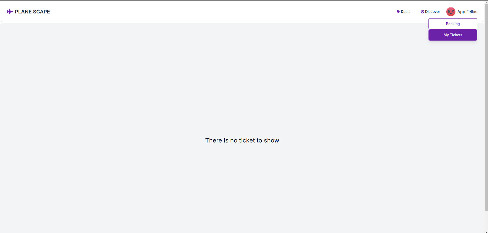
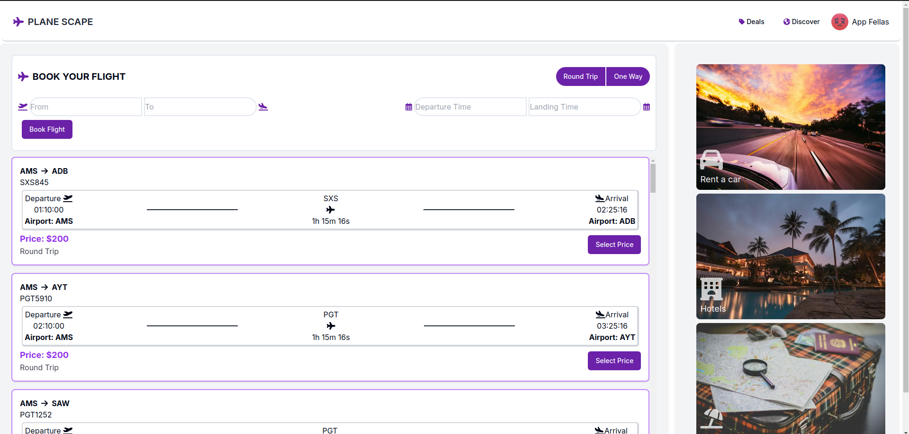
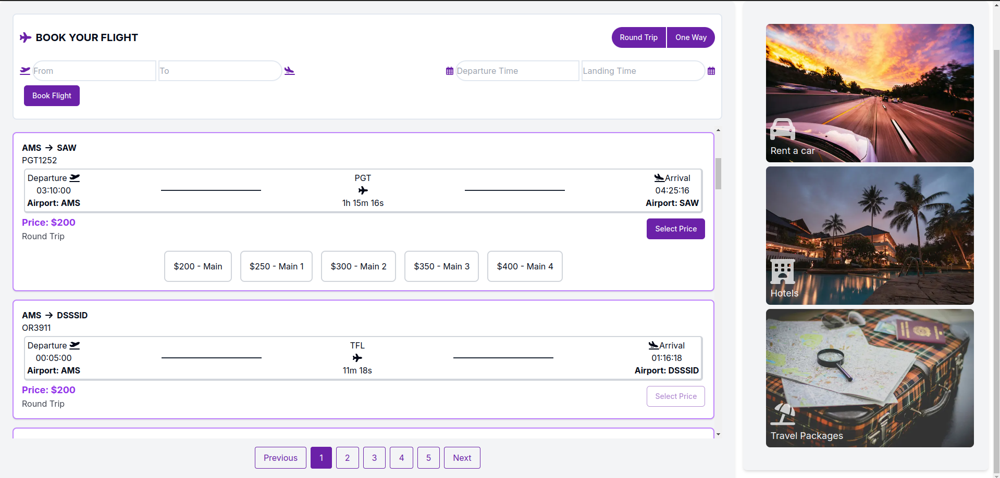
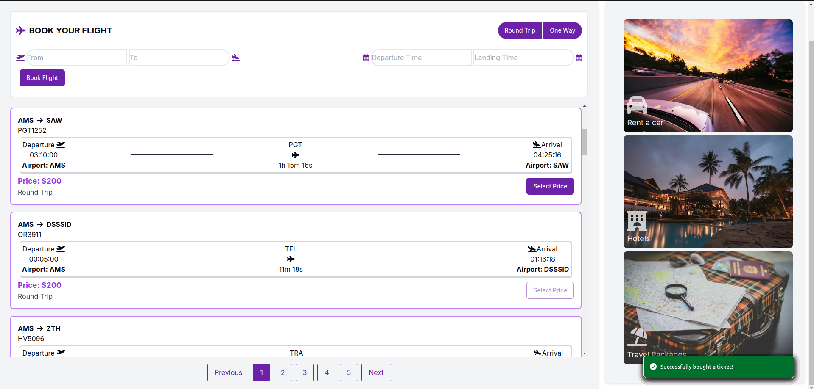
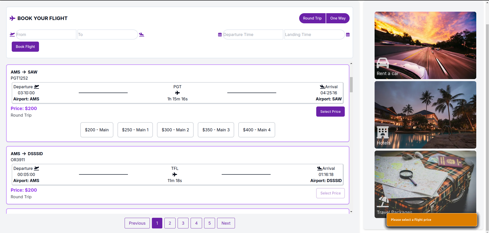
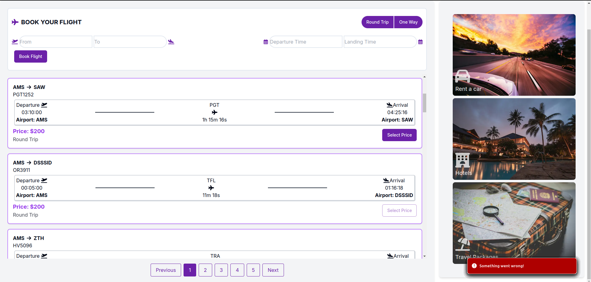
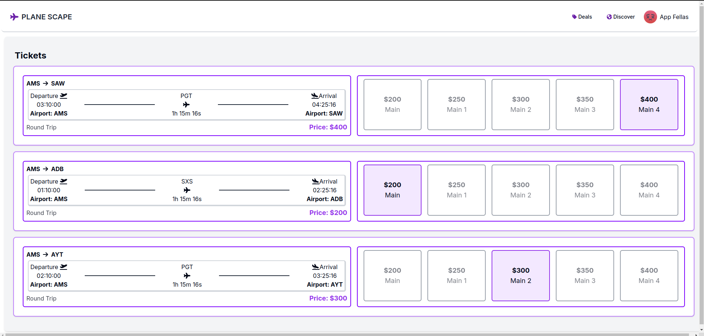

Bu uygulama AMS Schiphol havaalanının api'ına bağlanarak uçuş verilerini sıralayan ve seçilen uçuşları MongoDB'ye satın alınmış bir bilet gibi kaydeden bir NextJS uygulamasıdır.

Kurulum Aşaması:

1-) Projeyi indirdikten sonra "npm install" ile gerekli kurulumları yapınız.

2-) "npx shadcn-ui@latest init" komutuyla shadcn kurulumunu gerçekleştirin. Shadcn ile button varyantları özelleştirilmiştir.
    ShadCN kurulumunu yaparken bu şekilde seçiniz.

    ✔ Which style would you like to use? › Default

    ✔ Which color would you like to use as base color? › Slate

    ✔ Would you like to use CSS variables for colors? … yes

3-) root dizine ".env.local" dosyası oluşturun.

4-) .env.local içerisine geçerli keyleri ve valueları giriniz.

    NEXT_PUBLIC_APP_ID=

    NEXT_PUBLIC_APP_KEY=

    MONGO_URI=

5-) "npm run dev" komutuyla kodu çalıştırın.

Web application önizlemelerine buradan göz atabilirsiniz.

Ön İzleme

Biletlerim sayfası boş gösterim.

Uçuşlar sayfası.

Bilet seçenekleri ve satın alınamaz biletler.

Bilet satın alma aşaması uyarıları.

Başarılı satis.

Uyarı.

Başarısız satış.

Biletlerim sayfası

